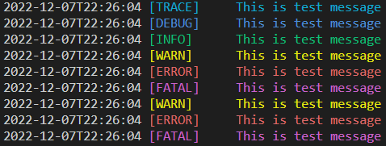

# Logger
Simple logger for go lang.
* Colors
* Leveled
* With write File



## Install
```
go get github.com/kur065/logger
```

## Usage
```
package main

import (
	"github.com/kur065/logger"
)


func main() {
    log := logger.New()

    // default INFO
    log.SetLogLevel(logger.TRACE)

    // default ./log.txt
    log.SetFilePath("./test.log")

    // default time.RFC3339
    log.SetTimeFormat("2006-01-02T15:04:05")

    message := "This is test message"
    log.Trace(message)
    log.Debug(message)
    log.Info(message)
    log.Warn(message)
    log.Error(message)
    log.Fatal(message)

    // if you do not want to write file
    log.SetWriteFile(false)

    log.Trace(message)
    log.Debug(message)
    log.Info(message)
    log.Warn(message)
    log.Error(message)
    log.Fatal(message)
} 
```

## License
MIT